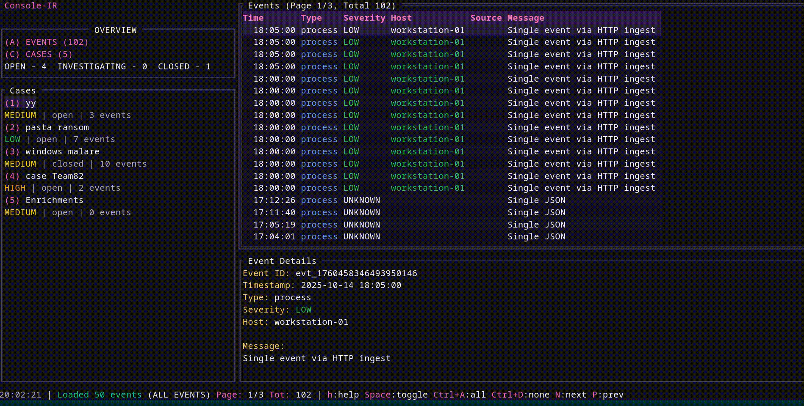
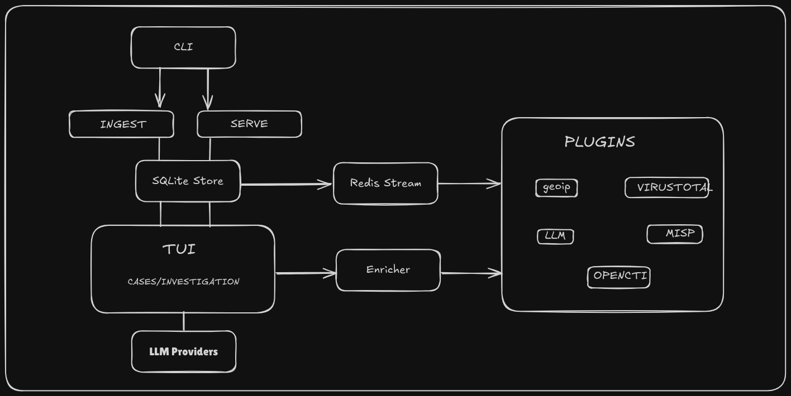

# OCSF Console IR

A terminal-first OCSF-based incident response manager for security analysts.

## **Overview**

- OCSF-native event ingestion
- Keyboard-first TUI for cases & events
- AI assisted Case Management
- Plugin-based enrichment via Redis Streams
- SQLite storage with FTS
- Pluggable LLM providers for summaries

### Demo - Short walkthrough
A quick tour of the TUI (cases & events).

[](docs/demo.mp4)


## **Quick Start**

### **Prerequisites**

- Go ≥ 1.23
- Docker (optional, for Redis)
- Git

### **Clone**

```bash
git clone https://github.com/Ashfaaq98/ocsf-console-ir.git
cd ocsf-console-ir

```

### **Build**

```bash
make build
```

### **Run TUI**

```bash
./bin/console-ir serve
```

Or headless:

```bash
./bin/console-ir serve --no-tui
```

## Ingesting events

#### 1. CLI file ingest

Run a JSONL file directly: `./bin/console-ir ingest <file>` — see [`console-ir/cmd/ingest.go`](console-ir/cmd/ingest.go).

#### 2. Folder drop-in

Drop files into `data/incoming`; the folder watcher ingests new files automatically (see [`console-ir/internal/ingest/folder.go`](console-ir/internal/ingest/folder.go)).

#### 3. HTTP ingestion

Enable the optional HTTP endpoint to POST events into the pipeline (see [`console-ir/internal/ingest/http_ingest.go`](console-ir/internal/ingest/http_ingest.go)).

#### 4. Live / stream ingestion

Real-time OCSF inputs and adapters publish to Redis Streams for processing (see [`console-ir/internal/ingest/live.go`](console-ir/internal/ingest/live.go) and [`console-ir/internal/ingest/ocsf.go`](console-ir/internal/ingest/ocsf.go)).

## **Plugins**

External plugins run as separate processes and consume/publish via Redis Streams. See [`docs/plugins.md`](docs/plugins.md).

By default external plugins are disabled; enable explicitly by creating an enable marker next to the executable (e.g., `plugins/llm/llm.enabled`) or start plugins manually.

## **Devcontainer & Debug**

Development is supported via [`.devcontainer/devcontainer.json`](.devcontainer/devcontainer.json) and debug settings in [`.vscode/launch.json`](.vscode/launch.json).

## **Architecture**



## **Troubleshooting**

- Ensure Redis is reachable at the configured URL.
- If TUI fails, run with --no-tui or use a native terminal.
- Build issues: run `go mod download` and `make build`.

## **Contributing**

- See the full contribution guide in [CONTRIBUTING.md](CONTRIBUTING.md) for workflow, coding standards, and local checks.
- Quick steps: fork the repo, create a branch, add tests, run `make check`, open a PR.

## **Security**

Do NOT commit API keys or secrets. Use the TUI or edit [`config/llm_settings.sample.json`](config/llm_settings.sample.json) and keep [`config/llm_settings.json`](config/llm_settings.json) ignored. See [`SECURITY.md`](SECURITY.md) for disclosure guidance.

## **License**

AGPLv3 - see [`LICENSE`](LICENSE)

## **Support**

- Issues: https://github.com/Ashfaaq98/ocsf-console-ir/issues
- Discussions: https://github.com/Ashfaaq98/ocsf-console-ir/discussions
