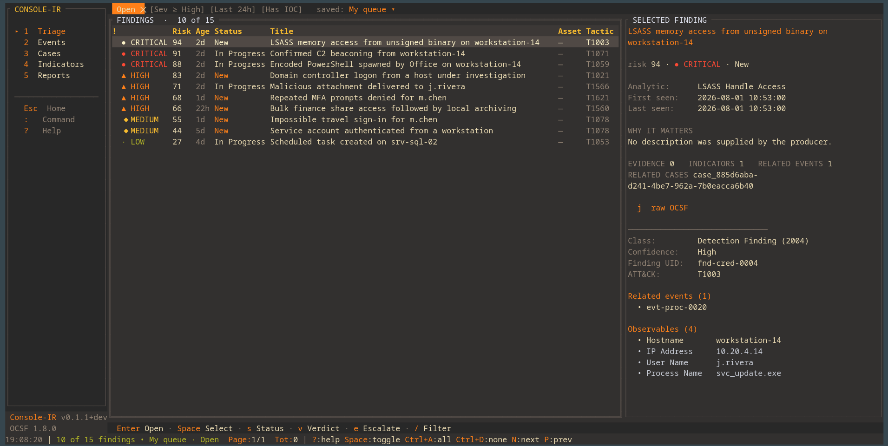

<div align="center">


<h1>OCSF Console IR</h1>

<p><b>Incident response for the terminal, not another platform to deploy.</b></p>

<p>
  <a href="https://github.com/Ashfaaq98/ocsf-console-ir/releases"></a>
  <a href="https://github.com/Ashfaaq98/ocsf-console-ir/actions/workflows/ci.yml"></a>
  <a href="go.mod"></a>
  <a href="https://github.com/Ashfaaq98/ocsf-console-ir/releases"></a>
  <a href="https://schema.ocsf.io/"></a>
  <a href="LICENSE"></a>
</p>

</div>

<div align="center">
  
</div>

## Overview

Console-IR is a **terminal-first, OCSF-native** incident-response workspace. It ingests
[OCSF](https://schema.ocsf.io/) detections and events, enriches indicators, and gives an analyst a
keyboard-driven place to triage, investigate and document incidents. You open it to a ranked queue of **findings**, the detections your SIEM or EDR actually flagged, rather than a wall of log lines. Raw events stay one keystroke away as the corroboration layer. Everything runs from a single binary backed by SQLite. No broker, no server, no cloud.

> **Status: early and evolving (v0.2.x).** The TUI workflow is the supported path today. Anything
> marked **⚗ experimental** below works but is not settled — expect rough edges, and expect it to
> change between releases.
>
> **Found a bug? Please [open an issue](https://github.com/Ashfaaq98/ocsf-console-ir/issues/new).**
> Include what you ran, what you expected and what happened; `console-ir version` prints the build
> and resolved paths. Bug reports on early software are the most useful thing you can send.

## Install

```bash
# Homebrew (macOS / Linux)
brew install Ashfaaq98/tap/console-ir

# curl (Linux / macOS)
curl -sSfL https://raw.githubusercontent.com/Ashfaaq98/ocsf-console-ir/main/scripts/install.sh | bash

# Scoop (Windows)
scoop bucket add ashfaaq98 https://github.com/Ashfaaq98/scoop-bucket
scoop install console-ir

# From source (Go >= 1.23)
git clone https://github.com/Ashfaaq98/ocsf-console-ir.git
cd ocsf-console-ir && make build
```

Prebuilt archives for Linux, macOS and Windows — Intel and ARM on all three — are on the
[releases page](https://github.com/Ashfaaq98/ocsf-console-ir/releases), with checksums and an SBOM.
More in [docs/installation.md](docs/installation.md).

## Quick start

```bash
console-ir demo
```

Loads a working week of four cases in different states, a few hundred events, one intrusion still
being worked into a throwaway database and opens the TUI. It never touches your real data.

Then point it at your own:

```bash
console-ir ingest events.jsonl   # a file, a directory, or - for stdin
console-ir                       # open the TUI
```

<div align="center">
  
</div>

Press `?` anywhere for the keys that apply to the screen you are on.
[docs/getting-started.md](docs/getting-started.md) walks through a first investigation.

## Why Console-IR?

Most IR tooling assumes you have already deployed it: a backend, a browser, a database to operate.
That holds in the SOC and breaks everywhere else: on a jump box mid-incident, on an IR laptop in a
datacentre, in an airgapped lab, over SSH on a host you were handed ten minutes ago. Console-IR assumes the opposite: one binary you can copy anywhere, storage in a file, an interface
that works over SSH. Ingesting, triaging and writing up a case need no network at all; only the
optional enrichment and LLM features reach outside the machine.


## Core features

- **Findings-first triage.** A queue ranked by risk; status and verdict set from the keyboard
- **Real OCSF semantics.** The `activity_id` lifecycle is honoured, so one alert reported five times stays one row
- **Indicator pivot.** Observables are indexed, so "everything touching this IP" is a lookup, not a scan
- **Cases that match the schema.** Findings as *members*, events as *evidence*, many-to-many
- **Built-in enrichment.** GeoIP and WHOIS run in-process — no enrichment service to deploy,
  though both query the internet today (offline GeoIP is on the roadmap)
- **Local SQLite storage.** Full-text search, and your data never leaves the machine

Also inside: stdin and folder ingestion, case timelines, a decision log, and indicator extraction.

**⚗ Experimental** — usable, but not settled:

- **The AI copilot and case summaries.** Optional and off unless configured. The shipped default
  (local Ollama) needs a model that answers within 60 seconds, which CPU-only hardware may not manage
- **Headless / HTTP ingestion.** `ingest --watch` is headless today; the HTTP receiver refuses to
  start without a TUI rather than accept events it would not store
- **External threat-intel plugins.** MISP, OpenCTI and IntelOwl integrations live in `plugins/` and
  run as separate processes over Redis Streams. Embedding them in the binary, the way GeoIP and WHOIS
  already are, is roadmap — until then they need a Redis to talk over
- **The high-contrast and colourblind-safe themes.** Registered, but not yet verified screen by screen

### What "OCSF-native" means here

A vendored **OCSF 1.8.0** registry decides what each record is, rather than hand-written guesses:

| Arrives as | Becomes |
|---|---|
| Findings category, `class_uid` 2001–2008 | a **finding** |
| Activity class with `is_alert: true` | **both** a finding and an event |
| Any other activity class | an **event** |


## Architecture


Records flow **ingest → OCSF parser → router → SQLite → TUI**. The router reads `class_uid` and
`is_alert` to decide what arrived, and indicators are indexed on the way through, which is what makes
the pivot a single lookup rather than a scan. Enrichment runs on an in-process worker queue, and the
open pane redraws when a result lands.

Full detail in [docs/architecture.md](docs/architecture.md).

## Documentation

| | |
|---|---|
| [Getting started](docs/getting-started.md) | First run, keys, a worked investigation |
| [Installation](docs/installation.md) | Every install method, verification, building from source |
| [Ingestion](docs/ingestion.md) | Files, directories, stdin, watch mode, HTTP |
| [Configuration](docs/configuration.md) | Paths, logging, LLM providers, themes, Redis |
| [Architecture](docs/architecture.md) | How records flow, the storage model, enrichment |
| [Migration](docs/migration.md) | Upgrading from v0.1.x |
| [Troubleshooting](docs/troubleshooting.md) | When something does not appear |
| [Plugins](docs/plugins.md) | Writing and enabling external plugins |

## Contributing

See [CONTRIBUTING.md](CONTRIBUTING.md) before writing code — Console-IR is single-author for now.
**Bug reports and feature requests are very welcome** and carry none of that overhead:
[open an issue](https://github.com/Ashfaaq98/ocsf-console-ir/issues/new).

Do **not** commit API keys or secrets. Real settings live in your per-user config directory, not in
the repo. See [SECURITY.md](SECURITY.md) to report a vulnerability.

## License

[AGPLv3](LICENSE)

- Issues: <https://github.com/Ashfaaq98/ocsf-console-ir/issues>
- Discussions: <https://github.com/Ashfaaq98/ocsf-console-ir/discussions>
