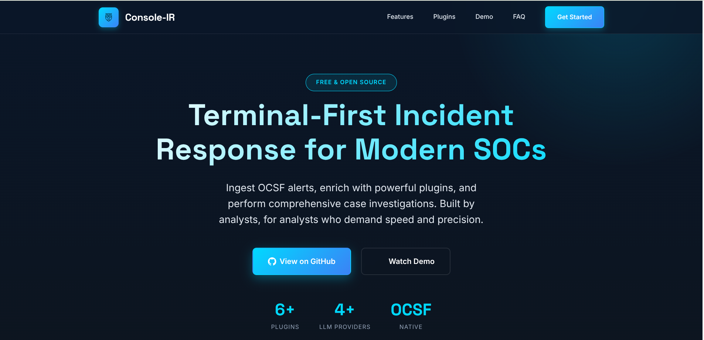
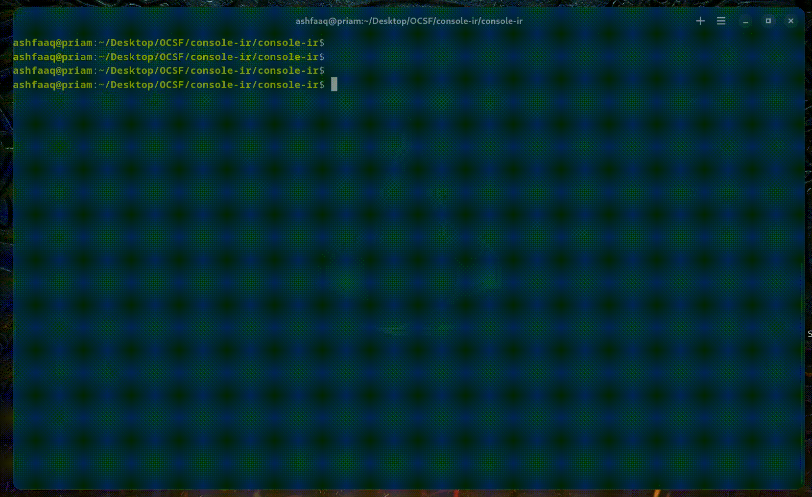
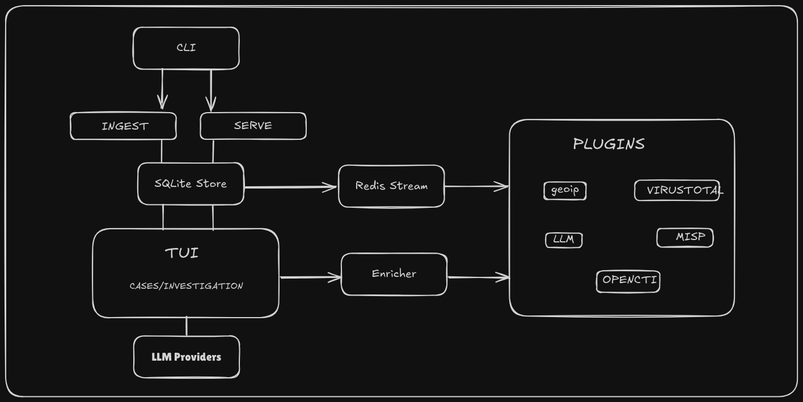

# OCSF Console IR

[](https://github.com/Ashfaaq98/ocsf-console-ir/releases)
[](https://github.com/Ashfaaq98/ocsf-console-ir/pkgs/container/console-ir)




## **Overview**

OCSF Console IR is a terminal-first incident response manager designed for security analysts. It leverages the OCSF (Open Cybersecurity Schema Framework) standard to provide a unified platform for event ingestion, case management, and AI-assisted analysis.

## **Features**

- OCSF-native event ingestion
- Keyboard-first TUI for cases & events
- Built-in enrichment (GeoIP, WHOIS) — in-process, no external services
- AI-assisted case management with pluggable LLM providers
- SQLite storage with full-text search
- Runs fully offline: a single binary, no broker, no database server
- Optional Redis + threat-intel plugins (MISP, OpenCTI, IntelOwl) for distributed setups

## **Installation**

### Homebrew (macOS / Linux)

```bash
brew install Ashfaaq98/tap/console-ir
```

### curl installer (Linux / macOS)

```bash
curl -sSfL https://raw.githubusercontent.com/Ashfaaq98/ocsf-console-ir/main/scripts/install.sh | bash
```

### Docker (experimental)

Console-IR is a terminal-first tool; the container is intended for inspecting the
CLI and for future headless use. Folder ingestion and enrichment currently run
only with the TUI active, so a headless container does not yet process events.

```bash
docker run --rm -it ghcr.io/ashfaaq98/console-ir:latest --help
```

### Build from source

```bash
git clone https://github.com/Ashfaaq98/ocsf-console-ir.git
cd ocsf-console-ir
make build
./bin/console-ir serve
```

### Demo - Short walkthrough

A quick tour of the TUI.

[](assets/demo.mp4)


## **Quick Start**

### **Prerequisites**

- Go ≥ 1.23
- Git
- Docker (optional — only for the experimental distributed mode with Redis + threat-intel plugins)

### **Clone**

```bash
git clone https://github.com/Ashfaaq98/ocsf-console-ir.git
cd ocsf-console-ir

```

### **Build**

```bash
make build
```

### **Run**

Load the shipped sample and open it in the TUI:

```bash
mkdir -p data/incoming
cp examples/sample-events.jsonl data/incoming/
./bin/console-ir serve
```

Select **ALL EVENTS**, open an event, and you'll see GeoIP/WHOIS enrichment
attached (press `r` to refresh as enrichment lands). To ingest your own data,
drop OCSF `.jsonl` files into `data/incoming/` — on startup or while running.

Headless mode (`serve --no-tui`) is experimental and does not yet ingest.

## Ingesting events

#### 1. Folder drop-in (recommended)

Drop OCSF `.jsonl`/`.json` files into `data/incoming/` while the TUI is running —
they're ingested and enriched automatically. Files staged before launch are
picked up on startup. See [internal/ingest/folder.go](internal/ingest/folder.go).

#### 2. CLI file ingest

Pre-load a file into the store: `./bin/console-ir ingest <file>`. Note this batch
import does not run enrichment — open the events in the TUI for that. See
[cmd/ingest.go](cmd/ingest.go).

#### 3. HTTP ingestion (experimental)

An optional HTTP endpoint can accept POSTed events (localhost by default; a bearer
token is required on non-loopback binds). See
[internal/ingest/http_ingest.go](internal/ingest/http_ingest.go).

## **Enrichment & plugins**

GeoIP and WHOIS enrichment are **built in** and run in-process — no configuration,
no external services.

Threat-intel integrations (MISP, OpenCTI, IntelOwl) run as optional external
plugins over Redis Streams, for distributed deployments. They are disabled by
default; enable one by creating an enable marker next to its executable (e.g.
`plugins/misp/misp.enabled`). See [`docs/plugins.md`](docs/plugins.md).

## **Devcontainer & Debug**

Development is supported via [`.devcontainer/devcontainer.json`](.devcontainer/devcontainer.json) and debug settings in [`.vscode/launch.json`](.vscode/launch.json).

## **Architecture**



## **Troubleshooting**

- Empty event list? Drop `examples/sample-events.jsonl` into `data/incoming/` and press `r`.
- If the TUI won't start, use a native terminal (it needs a real TTY); `--no-tui` is experimental and does not ingest.
- Enrichment is asynchronous — press `r` to refresh an event's detail once WHOIS/GeoIP lookups complete.
- Build issues: run `go mod download` and `make build`.
- Redis is only needed for the optional distributed mode (`--redis ...`); the default is standalone with no external services.

## **Contributing**

- See the full contribution guide in [CONTRIBUTING.md](CONTRIBUTING.md) for workflow, coding standards, and local checks.
- Quick steps: fork the repo, create a branch, add tests, run `make check`, open a PR.

## **Security**

Do NOT commit API keys or secrets. Use the TUI or edit [`config/llm_settings.sample.json`](config/llm_settings.sample.json) and keep [`config/llm_settings.json`](config/llm_settings.json) ignored. See [`SECURITY.md`](SECURITY.md) for disclosure guidance.

## **License**

AGPLv3 - see [`LICENSE`](LICENSE)

## **Support**

- Issues: https://github.com/Ashfaaq98/ocsf-console-ir/issues
- Discussions: https://github.com/Ashfaaq98/ocsf-console-ir/discussions
